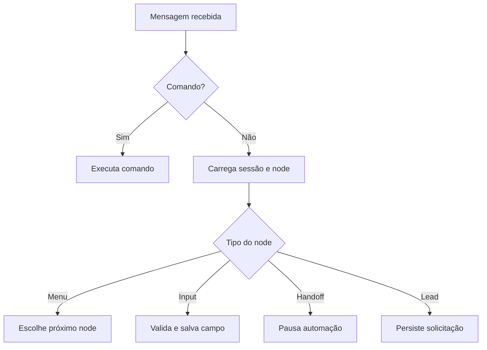

# 🤖 WhatsApp Bot Boilerplate — Node.js

> Boilerplate open source para criar bots de WhatsApp com fluxos de atendimento, sessões, Redis, testes e estrutura preparada para integração com IA.

<p align="center">
  
  
  
</p>


---

## ✨ Por que usar este template?

- ✅ **Sessão salva** — faça o login via QR Code apenas uma vez
- ✅ **Sistema de fluxos e menus** — navegação por números e palavras-chave
- ✅ **Fluxos configuráveis por JSON** — personalize o atendimento sem alterar o motor
- ✅ **Sessões por usuário** — cada pessoa tem seu próprio estado de conversa
- ✅ **Textos centralizados** — edite todas as mensagens em um único arquivo
- ✅ **Estrutura modular** — fácil de escalar e adicionar novas funcionalidades
- ✅ **Registro de comandos** — adicione comandos sem mexer no roteador
- ✅ **Sessões com TTL** — estado expira automaticamente e é trocável por Redis
- ✅ **Rate limiting** — proteção básica contra flood por usuário
- ✅ **Fila por usuário** — mensagens do mesmo contato são processadas na ordem correta
- ✅ **Captura de leads** — armazenamento local estruturado para demonstrações
- ✅ **Atendimento humano** — pausa automática do bot durante o handoff
- ✅ **Saúde e reconexão** — endpoints de liveness/readiness e retry progressivo
- ✅ **Logs estruturados e privados** — identificadores anônimos e corpo oculto por padrão
- ✅ **Cobertura automatizada** — Vitest, ESLint, Prettier e limites na CI
- ✅ **Guia de integração com IA** — exemplos para OpenAI, Gemini ou Claude

## 📌 Status do projeto

Este repositório é um ponto de partida funcional para estudos, protótipos e automações controladas. Ele não inclui uma integração de IA ativa e usa `whatsapp-web.js`, uma solução não oficial baseada no WhatsApp Web.

Para operações comerciais críticas, avalie a API oficial do WhatsApp Business e os requisitos de disponibilidade, privacidade e suporte do projeto.

---

## 📁 Estrutura do Projeto

```
template-bot-whatsapp/
├── src/
│   ├── flows/
│   │   ├── router.js         # Roteador central — toda mensagem passa por aqui
│   │   ├── mainMenu.js       # Carrega o fluxo configurado
│   │   ├── configurableFlow.js # Motor declarativo de atendimento
│   │   └── iaFlow.js         # Guia para plugar IA (OpenAI/Gemini/Claude)
│   ├── config/
│   │   └── flowLoader.js     # Leitura e validação dos fluxos JSON
│   ├── health/
│   │   └── server.js         # Endpoints /health e /ready
│   ├── commands/
│   │   ├── index.js          # Registro de comandos (keyword → handler)
│   │   └── ping.js           # Exemplo de comando por palavra-chave
│   ├── middlewares/
│   │   ├── logger.js         # Logger estruturado (JSON) com níveis
│   │   └── rateLimiter.js    # Rate limiting por usuário
│   ├── utils/
│   │   ├── messages.js       # ⭐ Todos os textos do bot em um só lugar
│   │   ├── sessionStore.js   # Sessões em memória com TTL
│   │   ├── redisSessionStore.js # Implementação opcional com Redis
│   │   ├── keyedQueue.js     # Fila independente por usuário
│   │   ├── leadStore.js      # Persistência de leads
│   │   ├── inputValidators.js # Validadores reutilizáveis
│   │   └── messageFilter.js  # Filtro de origens e mensagens ignoradas
│   └── config.js             # Configuração lida do .env
├── config/flows/             # Fluxo padrão em JSON
├── examples/pousada/         # Caso demonstrativo completo
├── docs/                     # Case, GIF, imagem e vídeo de demonstração
├── tests/                    # Testes (Vitest)
├── index.js                  # Ponto de entrada — inicializa o cliente
├── .env.example              # Variáveis de ambiente de exemplo
├── eslint.config.mjs         # Configuração do ESLint
├── .prettierrc.json          # Configuração do Prettier
├── vitest.config.mjs         # Configuração de testes
├── .gitignore
└── package.json
```

---

## 🚀 Como rodar

### 1. Clone o repositório

```bash
git clone https://github.com/ericnacif/template-bot-whatsapp.git
cd template-bot-whatsapp
```

### 2. Instale as dependências

```bash
npm install
```

### 3. Configure as variáveis de ambiente

```bash
cp .env.example .env
```

Edite o `.env` com suas configurações. As variáveis disponíveis:

| Variável                    | Padrão                      | Descrição                                     |
| --------------------------- | --------------------------- | --------------------------------------------- |
| `BOT_FLOW_FILE`             | `config/flows/default.json` | Fluxo JSON ativo                              |
| `SESSION_TTL_MINUTES`       | `30`                        | Tempo de vida da sessão de conversa           |
| `SESSION_DRIVER`            | `memory`                    | Onde guardar sessões: `memory` ou `redis`     |
| `REDIS_URL`                 | —                           | URL do Redis (quando `SESSION_DRIVER=redis`)  |
| `RATE_LIMIT_WINDOW_SECONDS` | `10`                        | Janela do rate limit                          |
| `RATE_LIMIT_MAX_MESSAGES`   | `5`                         | Máximo de mensagens por janela                |
| `LOG_LEVEL`                 | `info`                      | Nível de log: `error`/`warn`/`info`/`debug`   |
| `LOG_MESSAGE_BODY`          | `false`                     | Inclui o texto recebido nos logs              |
| `LOG_HASH_SECRET`           | —                           | Mantém o hash anônimo estável entre reinícios |
| `LEAD_STORE_DRIVER`         | `file`                      | Armazena leads em `file` ou `memory`          |
| `LEAD_STORE_PATH`           | `data/leads.ndjson`         | Arquivo local de leads                        |
| `HEALTH_ENABLED`            | `true`                      | Ativa os endpoints de saúde                   |
| `HEALTH_PORT`               | `3000`                      | Porta do servidor de saúde                    |
| `RECONNECT_INITIAL_SECONDS` | `5`                         | Espera inicial para reconexão                 |
| `RECONNECT_MAX_SECONDS`     | `60`                        | Espera máxima entre tentativas                |
| `OPENAI_API_KEY`            | —                           | Chave da OpenAI (opcional)                    |
| `GEMINI_API_KEY`            | —                           | Chave do Gemini (opcional)                    |
| `ANTHROPIC_API_KEY`         | —                           | Chave da Anthropic/Claude (opcional)          |

### 4. Inicie o bot

```bash
npm start       # inicia o bot
npm run dev     # com auto-reload (node --watch)
```

### 5. Escaneie o QR Code

Abra o WhatsApp no celular → **Dispositivos conectados** → **Conectar dispositivo** → escaneie o QR Code que aparece no terminal.

> 💡 A sessão é salva localmente. Você só precisa escanear uma vez.

---

## 🧪 Testar sem WhatsApp

Quer validar os menus e comandos sem conectar um número? Use o simulador:

```bash
npm run simulate
npm run simulate:pousada
```

O segundo comando executa o caso fictício da **Pousada Serra Verde**, com captura de reserva e atendimento humano. Os dois usam o mesmo motor da aplicação real. Use `/sair` para encerrar.

- [Assistir ao vídeo de 32 segundos](docs/demo-pousada.mp4)
- [Ler o case completo](docs/portfolio-case.md)

---

## 💬 Como funciona o sistema de fluxos

O motor lê um arquivo JSON, mantém uma sessão por usuário e percorre os nodes definidos. Menus, perguntas, validações, captura de dados e handoff usam a mesma estrutura declarativa.



---

## 🛠️ Como personalizar

Copie `config/flows/default.json`, altere mensagens e transições e aponte `BOT_FLOW_FILE` para o novo arquivo.

```json
{
    "id": "meu-negocio",
    "initialStep": "menu",
    "triggerWords": ["oi", "menu"],
    "nodes": {
        "menu": {
            "type": "menu",
            "message": "Como posso ajudar?",
            "options": {
                "1": { "next": "contato" }
            }
        },
        "contato": {
            "type": "message",
            "message": "Nosso contato é contato@exemplo.com"
        }
    }
}
```

Tipos disponíveis: `menu`, `input`, `message`, `handoff` e `save_lead`. Inputs aceitam os validadores `non_empty`, `positive_integer`, `date_br` e `date_after:campo`; mensagens podem usar variáveis como `{{lead.name}}`.

### Adicionar um novo comando por palavra-chave

1. Crie um arquivo em `src/commands/meuComando.js`:

```js
async function meuComando(message) {
    return message.reply('Resposta do meu comando!');
}
module.exports = { meuComando };
```

2. Registre no `src/commands/index.js`:

```js
const { meuComando } = require('./meuComando');

const commands = {
    ping: pingCommand,
    'minha-palavra': meuComando,
};
```

O roteador resolve o comando automaticamente — você não precisa tocar no `router.js`.

## 🙋 Atendimento humano e leads

O node `handoff` pausa respostas automáticas pelo período configurado. A palavra `menu` reativa o bot antes do prazo. O node `save_lead` registra os campos coletados em `data/leads.ndjson`; para testes, use `LEAD_STORE_DRIVER=memory`.

O arquivo de leads contém dados pessoais. Defina acesso, retenção e consentimento adequados antes de usar o recurso fora de uma demonstração.

---

## 🤖 Preparando uma integração com IA

A IA não vem ativa. O arquivo `src/flows/iaFlow.js` contém exemplos comentados; escolha um provedor, instale o SDK e implemente limites, histórico e tratamento de erros conforme o seu caso.

```bash
npm install openai
```

```js
// src/flows/iaFlow.js
const OpenAI = require('openai');
const openai = new OpenAI({ apiKey: process.env.OPENAI_API_KEY });

async function iaFlow(message) {
    const completion = await openai.chat.completions.create({
        model: 'gpt-4o-mini',
        messages: [{ role: 'user', content: message.body }],
    });
    return message.reply(completion.choices[0].message.content);
}
```

Depois registre no `router.js` como qualquer outro fluxo.

---

## 💾 Persistência de sessão

Por padrão as sessões ficam em memória (`SESSION_DRIVER=memory`) e expiram pelo
`SESSION_TTL_MINUTES`. Para sobreviver a reinícios e rodar com múltiplas instâncias,
use Redis:

```bash
SESSION_DRIVER=redis
REDIS_URL=redis://127.0.0.1:6379
```

Os dois drivers usam a mesma interface (`get`/`set`/`reset`), então os fluxos não mudam.

---

## 🩺 Saúde e reconexão

- `GET /health` confirma que o processo está em execução.
- `GET /ready` retorna `200` apenas quando o cliente do WhatsApp está conectado.
- Após uma desconexão, o cliente tenta se conectar novamente com espera progressiva até o limite configurado.

O healthcheck do contêiner usa o endpoint de liveness. Orquestradores e balanceadores devem usar `/ready` para decidir quando enviar tráfego.

---

## 🐳 Docker

```bash
cp .env.example .env
docker compose up --build
```

O Compose inicia o bot e o Redis, preserva autenticação, leads e sessões em volumes e publica os endpoints de saúde na porta `3000`. Na primeira execução, escaneie o QR Code exibido no terminal.

---

## 🧪 Scripts

| Comando                    | O que faz                                      |
| -------------------------- | ---------------------------------------------- |
| `npm start`                | Inicia o bot                                   |
| `npm run dev`              | Inicia com auto-reload (`node --watch`)        |
| `npm run simulate`         | Testa o fluxo padrão sem WhatsApp              |
| `npm run simulate:pousada` | Executa o case completo da pousada             |
| `npm test`                 | Roda os testes (Vitest)                        |
| `npm run test:coverage`    | Roda testes e verifica os limites de cobertura |
| `npm run test:watch`       | Testes em modo watch                           |
| `npm run lint`             | Verifica o código com ESLint                   |
| `npm run check`            | Executa lint, formatação e testes              |
| `npm run audit`            | Audita dependências de produção                |
| `npm run format`           | Formata o código com Prettier                  |

---

## 📦 Dependências

| Pacote                                                            | Versão  | Descrição                               |
| ----------------------------------------------------------------- | ------- | --------------------------------------- |
| [whatsapp-web.js](https://github.com/pedroslopez/whatsapp-web.js) | ^1.34.7 | Interface não oficial para WhatsApp Web |
| [qrcode-terminal](https://github.com/gtanner/qrcode-terminal)     | ^0.12.0 | Exibe QR Code no terminal               |
| [dotenv](https://github.com/motdotla/dotenv)                      | ^16.6.1 | Carrega variáveis de ambiente do `.env` |
| [redis](https://github.com/redis/node-redis)                      | ^4.7.0  | Persistência de sessão (driver Redis)   |

---

## ⚠️ Limitações e segurança

- A integração usa automação não oficial do WhatsApp Web e pode ser afetada por mudanças na plataforma.
- Não utilize o projeto para spam ou ações contrárias aos [Termos de Serviço do WhatsApp](https://www.whatsapp.com/legal/terms-of-service).
- O corpo das mensagens não é registrado por padrão. Ative `LOG_MESSAGE_BODY` somente com uma finalidade e política de retenção definidas.
- Em múltiplas instâncias, use Redis para o estado da conversa. A autenticação `LocalAuth` continua dependente de armazenamento persistente e requer uma estratégia operacional própria.
- Leads podem conter dados pessoais. Defina consentimento, controle de acesso, retenção e descarte antes de colocar o armazenamento em produção.
- Consulte [SECURITY.md](SECURITY.md) para relatar vulnerabilidades.

---

## 🗺️ Roadmap em duas etapas

### Etapa 1 — portfólio (v1.2.0)

Fluxos JSON, case de pousada, captura de leads, handoff humano, Docker Compose com Redis, saúde, reconexão, cobertura automatizada e materiais visuais demonstrativos.

### Etapa 2 — produto comercial

Migração para a API oficial do WhatsApp Cloud, banco de dados gerenciado, painel administrativo, autenticação e permissões, integração real com IA, métricas/alertas, políticas LGPD e arquitetura multiempresa. Esses itens são roadmap e ainda não fazem parte desta versão.

---

## 📄 Licença

MIT © [Eric Nacif](https://github.com/ericnacif)

---

<p align="center">
  Se este template te ajudou, deixe uma ⭐ — isso ajuda muito!
</p>
