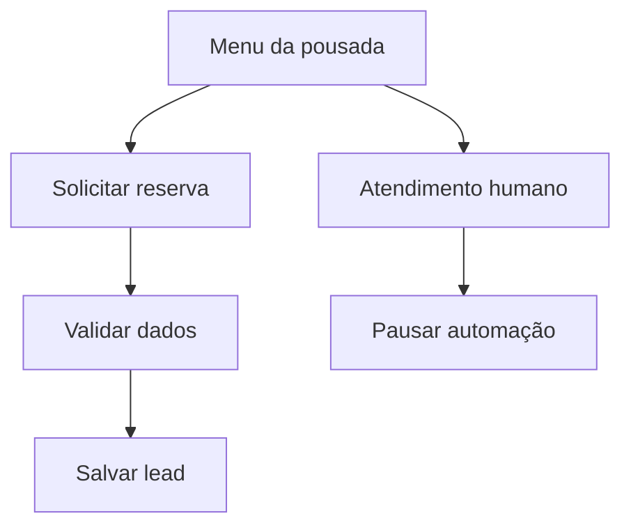

# Case de portfólio — atendimento para pousada

## Visão geral

Este case demonstra como o boilerplate pode atender uma pequena pousada sem transformar regras de negócio em código espalhado. A empresa é fictícia e os preços são meramente ilustrativos.

O visitante consulta acomodações, envia uma solicitação de reserva e pode pedir atendimento humano. O bot valida os dados, registra o lead e pausa a automação durante a transferência.

## Problema

Pequenos negócios costumam responder repetidamente às mesmas perguntas e perdem solicitações que chegam fora do horário. Uma solução de portfólio precisa mostrar a conversa inteira, persistir o interesse e continuar simples de adaptar.

## Solução entregue

- Fluxos declarativos em JSON, sem alteração do motor para trocar textos ou caminhos.
- Coleta e validação de nome, entrada, saída e quantidade de hóspedes.
- Persistência local em NDJSON ou armazenamento em memória para testes.
- Handoff que pausa respostas automáticas por um período configurável.
- Sessões em memória ou Redis, fila por contato e rate limiting.
- Endpoints de saúde, reconexão progressiva, logs privados e encerramento seguro.
- Docker Compose com bot, Redis e volumes persistentes.



## Como demonstrar

Não é necessário conectar um número para apresentar o fluxo:

```bash
npm install
npm run simulate:pousada
```

Digite, em sequência: `oi`, `2`, um nome, uma data de entrada, uma data de saída e o número de hóspedes. Use `falar com atendente` para demonstrar o handoff e `/sair` para encerrar.

- [Vídeo de 32 segundos](demo-pousada.mp4)
- [Captura estática](demo-pousada.png)
- Arquivo do fluxo: [`examples/pousada/flow.json`](../examples/pousada/flow.json)

## Evidências técnicas

Na versão 1.2.0, a suíte possui 52 testes distribuídos em 14 arquivos. Os limites mínimos da CI são 75% para statements, funções e linhas e 70% para branches. A imagem Docker também é construída na CI.

Para reproduzir a validação:

```bash
npm run check
npm run test:coverage
npm run audit
```

## Decisões e limites

O JSON torna a personalização acessível e testável, mas não substitui um editor visual. O NDJSON deixa a demonstração simples e auditável, mas não é um banco de produção. O `whatsapp-web.js` permite um protótipo rápido, porém não é a integração oficial do WhatsApp.

Por isso, esta entrega é posicionada como projeto de portfólio e base técnica. Ela não promete SLA, conformidade ou operação comercial crítica.

## Próxima etapa comercial

Uma evolução comercial deve incluir API oficial do WhatsApp Cloud, banco gerenciado, painel administrativo, autenticação e papéis, integração ativa com IA, métricas e alertas, políticas LGPD e isolamento multiempresa.

## Resumo para portfólio

> Desenvolvi um boilerplate de atendimento para WhatsApp em Node.js com fluxos configuráveis por JSON, captura de leads, transferência para atendimento humano, sessões Redis, fila por contato, observabilidade básica, Docker e suíte automatizada. Criei um case fictício de pousada e um simulador de terminal para demonstrar a jornada sem depender de um número conectado.
